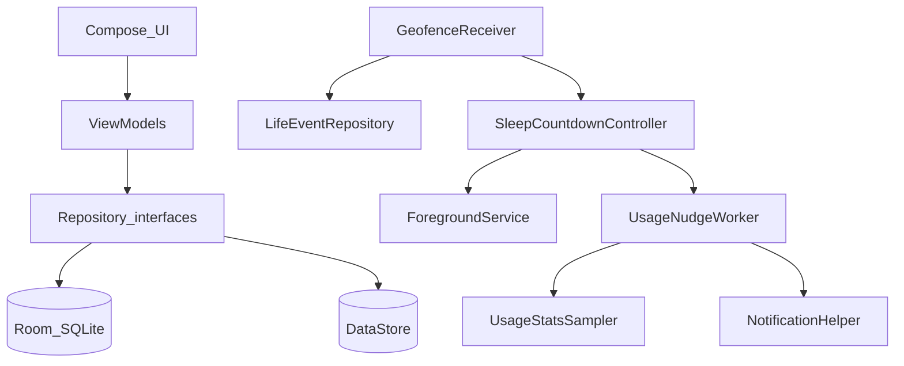

# Sleep Roulette

Personal Android MVP for irregular / shift sleep schedules. **You are the only user.** Local-only data. No accounts, no cloud, no iOS/web.

Target device: **Oppo Reno 11F (CPH2603), Android 16 / ColorOS**.

## Product promise

Help you get to bed more consistently by reacting to *life events*:

- Arrived home (geofence)
- Sleep countdown until goal bedtime / sunrise
- Phone still in use after goal → nudge

## Architecture (learn this)

```
ui/          Compose screens + ViewModels (state holders)
domain/      Pure Kotlin: models, policies, sunrise math, repository interfaces
data/        Room + DataStore implementations
location/    Geofencing (Play Services)
usage/       UsageStats sampling + WorkManager nudges
notify/      Notification channels + countdown foreground service
di/          Hilt modules
```

**Rules of thumb**

1. **Domain has zero Android imports** — so you can unit test sunrise + bedtime policy with plain JUnit.
2. **UI talks to repositories / controllers via ViewModels** — not to Room DAOs directly.
3. **Events are append-only** (`life_events`) — treat them like an observability log.
4. **ColorOS kills background work** — countdown uses a foreground service; Setup pushes battery exemption + Autostart.



## Stack

| Piece | Choice |
|-------|--------|
| Language | Kotlin 2.1 |
| UI | Jetpack Compose + Material 3 |
| DI | Hilt |
| DB | Room |
| Prefs | DataStore |
| Async | Coroutines + Flow |
| Location | Play Services Geofencing |
| Jobs | WorkManager |

## Build & run

```bash
cd sleep-roulette
./gradlew :app:assembleDebug
adb install -r app/build/outputs/apk/debug/app-debug.apk
```

Open **Setup** first:

1. Fine location → Background location  
2. Usage access  
3. Ignore battery optimizations  
4. ColorOS Autostart (App settings)  
5. **Use current location as Home**  
6. Set bedtime goal  

From **Today**, tap **I'm home** to manually start the countdown while testing geofences.

## Tests

```bash
./gradlew :app:testDebugUnitTest
```

Domain tests cover sunrise math and bedtime nudge policy — the parts that are easy to get wrong and easy to verify without a device.

## Repo

- Local folder: `sleep-roulette`
- Remote: https://github.com/Shahzaibalikhawaja/sleep-roulette
